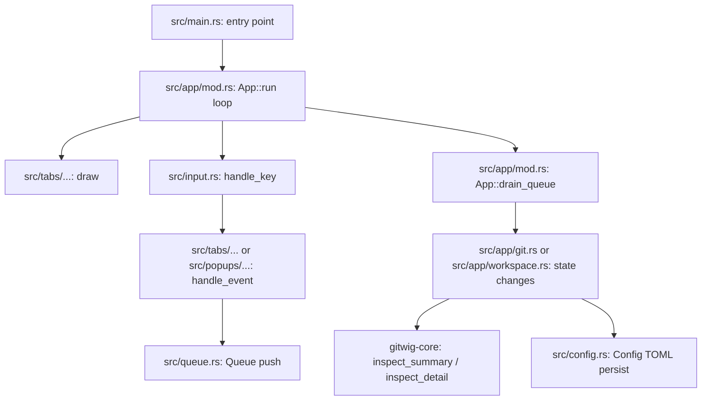

# Gitwig Codebase Map

This document provides a map of the Gitwig codebase, outlining its architectural patterns, module responsibilities, core state/mode management, and event control flow.

---

## 1. Architectural Overview

Gitwig follows a synchronous, single-threaded model for UI rendering and input handling, while offloading long-running Git operations (like fetch, pull, and rebase) to background threads. 

---

## 2. File & Module Reference

The codebase is organized into modular single-responsibility crates and files:

| Module / Folder | Location | Description |
| :--- | :--- | :--- |
| **Main Entry** | `src/main.rs` | Sets up terminal context, installs a panic hook to safely restore raw mode, and starts `app::run`. |
| **State Engine** | `src/app/` | Holds the core `App` struct and splits its method implementations across `mod.rs` (orchestration/drain_queue), `actions.rs` (home repository card mutations), `git.rs` (branches, tags, remotes, push/pull/fetch/rebase), `workspace.rs` (staging, commits, conflict resolution), `navigation.rs` (scrolling, sorting, settings), and `tests.rs` (the test suite). |
| **Input Router** | `src/input.rs` | Captures keyboard events and delegates routing to the active tab or popup. |
| **Component Queue** | `src/queue.rs` | Defines a thread-safe, lock-free queue (`Queue` and `InternalEvent`) used by components to request state changes from the engine. |
| **Theme & Style** | `src/ui/` | Contains the global styling definitions (`style.rs`), layout helper utilities (`layout.rs`), and theme configurations (`theme.rs`). |
| **Modal Popups** | `src/popups/` | Modular modal components for user inputs and confirmations (e.g. `commit.rs`, `confirm.rs`, `settings.rs`, `help.rs`). |
| **Application Tabs**| `src/tabs/` | Drawing logic for the home screen list and individual repository tabs (`home.rs`, `workspace.rs`, `files.rs`, `branches.rs`, `tags.rs`, `stashes.rs`, `overview.rs`). |
| **TUI Components** | `src/components/` | Reusable rendering widgets that maintain their own internal visual/table state (e.g. `file_tree.rs`, `commit_list.rs`, `branch_list.rs`, `diff.rs`). |
| **Git Core Backend** | `gitwig-core/` | Workspace crate containing all libgit2 inspections, repo info collection (`RepoInfo`, `CommitEntry`, etc.), status summaries, and file loading logic. Completely isolated from UI dependencies. |
| **Configuration** | `src/config.rs` | Manages loading, migrating, and saving TOML settings at `~/.gitwig/config.toml`. |

---

## 3. Core Data Structures

### UI Modes (`src/app/mod.rs`)
Keystrokes are interpreted conditionally depending on the active `Mode`:
- `Mode::Normal`: Home repository list view.
- `Mode::Adding` / `Mode::Editing`: Adding/editing repositories.
- `Mode::Detail`: Inspection tab view (active Workspace/Files/Graph/Branches/etc. tabs).
- `Mode::Inspect`: Fullscreen diff view (lines/hunks staging and discard).
- `Mode::CommitInput`: Centered commit message entry dialog.
- `Mode::BranchCreateInput` / `Mode::TagCreateInput`: Naming new branches/tags.
- `Mode::MergeAbortConfirm` / `Mode::MergeContinueConfirm`: Confirmations for merge abort/continue.
- `Mode::*Confirm`: Deleting, pushing, merging, or rebasing confirmations.

### Pane Focus (`src/app/mod.rs`)
Pane focus within tabs in `Mode::Detail` or `Mode::Inspect` is tracked by the `DetailSection` enum:
- **Workspace (Tab 0)**: `Commits`, `Staged`, `Unstaged`, `Conflicts`, `CommitDetails`, `StagingDetails`, `ConflictDiff`
- **Files (Tab 1)**: `Files`, `FileContent`
- **Branches (Tab 3)**: `LocalBranches`, `RemoteBranches`
- **Stashes (Tab 6)**: `Stashes`, `StashedFiles`, `StagingDetails`

---

## 4. Key Event Control Flow

When a user presses a key (e.g. staging all files with `a`):

1. **Capture**: `App::run` (`src/app/mod.rs`) polls for `crossterm::event::Event::Key`.
2. **Route**: Key event is passed to `handle_key` (`src/input.rs`), which delegates to the active tab (e.g., `WorkspaceTab::handle_event`).
3. **Queue Event**: The tab pushes an `InternalEvent::StageAllChanges` onto the `Queue` (`src/queue.rs`).
4. **Drain**: `App::drain_queue` (`src/app/mod.rs`) pops the event and triggers `App::stage_all_changes()` (`src/app/workspace.rs`).
5. **Git Execute**: `App::stage_all_changes` executes the operation via the `git2` backend inside `gitwig-core`.
6. **Refresh**: State is updated, and the frame is redrawn with the updated staging layout.

---

## 5. Coding Standards & Guidelines

- **Documentation**: Keep `README.md`, `INSTRUCTIONS.md`, and `ROADMAP.md` updated with any user-facing or technical changes.
- **TUI Theme Rules**: Never hardcode raw terminal colors like `Color::White` or `Color::Black` as they break visibility under light themes. Always use theme wrappers (`ACCENT`, `WARNING`, `DANGER`) or style helpers (`muted_style()`, `primary_style()`, `accent_style()`).
- **Safety**: Destructive git operations (delete tag, delete branch, discard file, discard all) must enforce a confirmation dialog mode (e.g., `Mode::DiscardChangesConfirm`).

