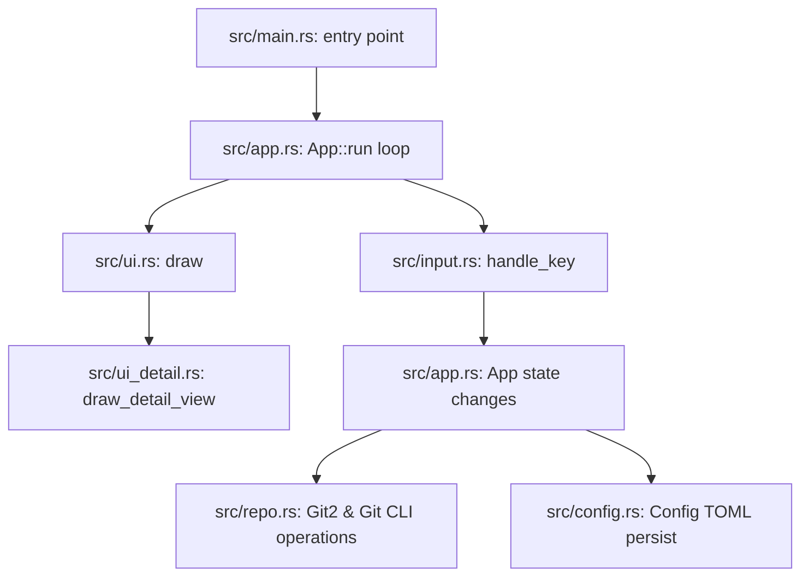

# Twig Codebase Map

This document provides a map of the Twig codebase, outlining its architectural patterns, module responsibilities, core state/mode management, and event control flow.

---

## 1. Architectural Overview

Twig follows a synchronous, single-threaded model for UI rendering and input handling, while offloading long-running Git operations (like fetch, pull, and rebase) to background threads. 

---

## 2. File & Module Reference

The crate is organized into single-responsibility modules:

| Module | Location | Description |
| :--- | :--- | :--- |
| **Main Entry** | `src/main.rs` | Initializes the terminal (crossterm), starts the raw mode screen, and hands control over to `App::run`. Performs graceful terminal restore on exit or panic. |
| **State Engine** | `src/app.rs` | Holds the core `App` struct representing mutable session state. Manages sorting, navigation offsets, text input buffers, active tab, pane focus, splitter splits, and background thread communication. |
| **Keyboard Input** | `src/input.rs` | Captures keyboard input and routes `(Mode, KeyCode)` events to corresponding methods in `App`. Contains zero business logic, acting purely as a router. |
| **Home UI** | `src/ui.rs` | Renders the repository list on the home page, the layout splitters, help overlays, normal-mode status bars, and defines general theme style helpers. |
| **Detail UI** | `src/ui_detail.rs` | Renders the full-screen repository detail view. Manages drawing of Tabs 0 through 7 (Workspace, Files, Graph, Branches, Tags, Remotes, Stashes, Overview), popup overlays, and confirmation dialogs. |
| **Git Domain** | `src/repo.rs` | Abstracted git operations using `git2-rs` bindings or shelling out to the CLI. Handles staging, unstaging, committing, fetching, pulling, rebasing, tag management, stash operations, and diff generation. |
| **Configuration** | `src/config.rs` | Manages loading, updating, and saving user settings in `~/.twig/config.toml` (themes, sorting, fzf settings, polling intervals). |

---

## 3. Core Data Structures

### UI Modes (`src/app.rs`)
Keystrokes are interpreted conditionally depending on the active `Mode`:
- `Mode::Normal`: Home repository list view.
- `Mode::Adding` / `Mode::Editing`: Adding/editing repositories.
- `Mode::Detail`: Inspection tab view (active Workspace/Files/Graph/Branches/etc. tabs).
- `Mode::Inspect`: Fullscreen diff view (lines/hunks staging and discard).
- `Mode::CommitInput`: Centered commit message entry dialog.
- `Mode::BranchCreateInput` / `Mode::TagCreateInput`: Naming new branches/tags.
- `Mode::MergeAbortConfirm` / `Mode::MergeContinueConfirm`: Confirmations for merge abort/continue.
- `Mode::*Confirm`: Deleting, pushing, merging, or rebasing confirmations.

### Pane Focus (`src/app.rs`)
Pane focus within tabs in `Mode::Detail` or `Mode::Inspect` is tracked by the `DetailSection` enum:
- **Workspace (Tab 0)**: `Commits`, `Staged`, `Unstaged`, `Conflicts`, `CommitDetails`, `StagingDetails`, `ConflictDiff`
- **Files (Tab 1)**: `Files`, `FileContent`
- **Branches (Tab 3)**: `LocalBranches`, `RemoteBranches`
- **Stashes (Tab 6)**: `Stashes`, `StashedFiles`, `StagingDetails`

---

## 4. Key Event Control Flow

When a user presses a key (e.g. staging all files with `a`):

1. **Capture**: `App::run` (`src/app.rs`) polls for `crossterm::event::Event::Key`.
2. **Dispatch**: Key event is passed to `handle_key` (`src/input.rs`).
3. **Route**: Under `Mode::Detail` and focus `DetailSection::Unstaged`, pressing `a` maps to `app.stage_all_changes()`.
4. **Git Execute**: `App::stage_all_changes` calls `repo::stage_all_changes(&resolved_path)` (`src/repo.rs`).
5. **Auto-Focus**: Focus is updated `self.detail_focus = DetailSection::Staged` since unstaged became empty.
6. **Refresh**: `app.refresh_detail()` updates cached repo lists.
7. **Render**: The next frame draws the updated lists and shifts the highlighted pane border.

---

## 5. Coding Standards & Guidelines

- **Documentation**: Keep `README.md`, `INSTRUCTIONS.md`, and `ROADMAP.md` updated with any user-facing or technical changes.
- **TUI Theme Rules**: Never hardcode raw terminal colors like `Color::White` or `Color::Black` as they break visibility under light themes. Always use theme wrappers (`ACCENT`, `WARNING`, `DANGER`) or style helpers (`muted_style()`, `primary_style()`, `accent_style()`).
- **Safety**: Destructive git operations (delete tag, delete branch, discard file, discard all) must enforce a confirmation dialog mode (e.g., `Mode::DiscardChangesConfirm`).
