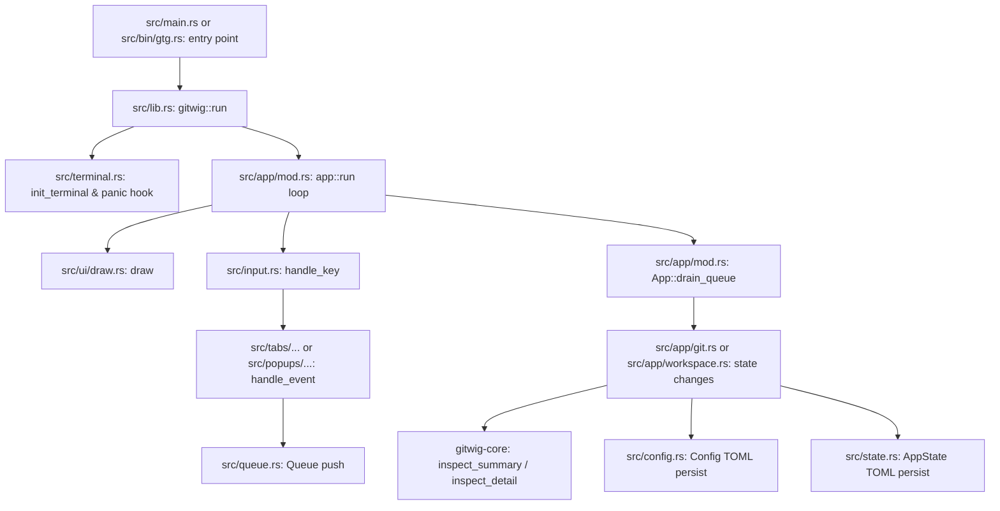

# Gitwig Codebase Map

This document provides a map of the Gitwig codebase, outlining its architectural patterns, module responsibilities, core state/mode management, and event control flow.

---

## 1. Architectural Overview

Gitwig follows a synchronous, single-threaded model for UI rendering and input handling, while offloading long-running Git operations (like fetch, pull, and rebase) to background threads. 

```mermaid
graph TD
    main[src/main.rs or src/bin/gtg.rs: entry point] --> lib_run[src/lib.rs: gitwig::run]
    lib_run --> term_init[src/terminal.rs: init_terminal & panic hook]
    lib_run --> app_run[src/app/mod.rs: app::run loop]
    app_run --> render[src/ui/draw.rs: draw]
    app_run --> input[src/input.rs: handle_key]
    input --> event_dispatch[src/tabs/... or src/popups/...: handle_event]
    event_dispatch --> queue[src/queue.rs: Queue push]
    app_run --> drain_queue[src/app/mod.rs: App::drain_queue]
    drain_queue --> state_mutation[src/app/git.rs or src/app/workspace.rs: state changes]
    state_mutation --> core_inspect[gitwig-core: inspect_summary / inspect_detail]
    state_mutation --> config_save[src/config.rs: Config TOML persist]
    state_mutation --> state_save[src/state.rs: AppState TOML persist]
```

---

## 2. File & Module Reference

The codebase is organized into modular single-responsibility crates and files:

| Module / Folder | Location | Description |
| :--- | :--- | :--- |
| **Main Entries** | `src/main.rs`, `src/bin/gtg.rs` | Thin binary wrappers calling shared `gitwig::run()`. |
| **Library Root** | `src/lib.rs` | Top-level execution orchestrator (`run`) setting up terminal, loading config, and starting `app::run`. |
| **Terminal Setup** | `src/terminal.rs` | Terminal initialization, raw mode management, `TerminalGuard` RAII cleanup, custom panic hook, and CLI flags checking. |
| **Embedded Terminal** | `src/terminal_session.rs` | PTY-backed shell session for the embedded terminal panel: `TerminalSession` (portable-pty + vt100 parser fed by a detached reader thread), keystroke-to-bytes encoding (`encode_key`), and Drop-based child kill/reap. |
| **State Engine** | `src/app/` | Holds the core `App` struct and splits its method implementations across `mod.rs` (orchestration/drain_queue), `actions.rs` (home repository card mutations), `git.rs` (branches, tags, remotes, push/pull/fetch/rebase), `workspace.rs` (staging, commits, conflict resolution), `navigation.rs` (scrolling, sorting, settings, and the persistence helpers `persist` / `persist_state`), `term_panel.rs` (embedded terminal panel open/hide/close and geometry), and `tests.rs` (the test suite). |
| **Input Router** | `src/input.rs` | Captures keyboard events and delegates routing to the active tab or popup. |
| **Mouse Handler** | `src/mouse.rs` | Listens to mouse clicks, scrolling, drag-to-resize splitters, and commit popup resize events. Home-header hit-tests (summary tabs, quick-label chips, the label badge on the frame border) measure the exact captions `draw.rs` renders (`summary_tab_parts`, `quick_label_parts`) or rects recorded during the draw pass (`global_summary_area`, `quick_label_area`, `label_badge_area`). |
| **Component Queue** | `src/queue.rs` | Defines a thread-safe, lock-free queue (`Queue` and `InternalEvent`) used by components to request state changes from the engine. |
| **Theme & Style** | `src/ui/` | Contains the main rendering logic (`draw.rs`), styling/theme configurations (`style.rs`), layout helper utilities (`layout.rs`), detailed inspection view (`ui_detail.rs`), the scrollbar helper for panels (`scrollbar.rs`), and the tokenizer/style map for syntax highlighting in previews and diffs (`syntax.rs`). |
| **Modal Popups** | `src/popups/` | Modular modal components for user inputs and confirmations (e.g. `commit.rs`, `confirm.rs`, `settings.rs`, `help.rs`, `forge_comment.rs`, `about.rs`). `command_palette.rs` is the `ctrl-p` overlay (`App.command_palette`, not a `Mode`): it lists the current context's actions and runs one by re-dispatching its key through `input::handle_key` with `App.forced_action` set, so the palette and the keyboard can never disagree. |
| **Application Tabs**| `src/tabs/` | Event handling and drawing for the home screen list and individual repository tabs (`home.rs`, `workspace.rs`, `files.rs`, `graph.rs`, `branches.rs`, `tags.rs`, `remotes.rs`, `stashes.rs`, `logs.rs`, `file_history.rs`). The Worktrees, Submodules, Reflog, Forge Issues, and Forge PRs tabs have no file here: their key handlers live in `src/tabs/mod.rs` (`handle_worktree_events`, `handle_submodule_events`, `handle_reflog_events`, `handle_forge_events`, `handle_forge_pr_events`) and they are drawn by `src/components/{worktree_list,submodule_list,reflog_list,forge_list,forge_pr_list}.rs`. |
| **TUI Components** | `src/components/` | Reusable rendering widgets that maintain their own internal visual/table state (e.g. `file_tree.rs`, `commit_list.rs`, `branch_list.rs`, `diff.rs`, `submodule_list.rs`, `terminal_panel.rs`, `cmd_bar/`). |
| **Git Core Backend** | `gitwig-core/` | Workspace crate containing all libgit2 inspections, repo info collection (`RepoInfo`, `CommitEntry`, etc.), status summaries, and file loading logic. Completely isolated from UI dependencies. |
| **Configuration** | `src/config.rs` | Manages loading, migrating, and saving TOML settings at `~/.gitwig/config.toml`. `load_config` also lifts any usage-state keys an older version left in `config.toml` into `state.toml`. |
| **Usage State** | `src/state.rs` | `AppState` — visits, per-repo commit-message history, quick-label slots, and the sticky label filter — persisted to `~/.gitwig/state.toml` beside the config so passive use never rewrites hand-edited settings. `App::persist_state` saves it alone; `App::persist` saves both. |
| **Keybinding Registry** | `src/keybindings.rs` | Data-driven action/keybind registry: the `Action` enum (with `from_index` / `to_index` for the Settings page), one `*Keybindings` struct per context (`GlobalKeybindings`, `HomeKeybindings`, `WorkspaceKeybindings`, …), `default_config()`, and the lookup/update helpers on `KeybindingsConfig` (`get`, `get_action_keys`, `matches`, `update_action_keys`, `find_conflict`). `KeybindingsConfig::load(config_dir)` applies user overrides; `App::is_bound(Action, key)` is what tabs and popups call. |
| **Legacy Key Tables** | `src/keys/` | Older, self-contained key tables (`key_config.rs` `KeyConfig`, `key_list.rs` `KeyList`, `symbols.rs` `KeySymbols`) kept under `#![allow(dead_code)]`. Nothing outside the module references them; live routing goes through `src/keybindings.rs`, and key display glyphs come from `KeybindingsConfig` plus the `config.rs` symbols table. |
| **Usage Statistics** | `src/stats.rs` | `AppStats` (total session time, commit/branch/merge/rebase/stash/network counters, per-repo activity, daily activity for the heatmap, forge review counts) with `stats_path` / `load_stats` / `save_stats`; feeds the `StatsDashboard` mode. |
| **Git Subprocesses** | `src/git_cmd.rs` | Hardened `git` subprocess construction: `git_command()` disables terminal prompts, askpass helpers, and host-key confirmation and nulls stdin; `run_git_with_timeout` kills a child that never answers. Every remote-touching `git` invocation in the `gitwig` crate is built here. |
| **Debug Log** | `src/debug_log.rs` | Simple log writer for debugging messages and crash backtraces (backs the `DebugLogs` mode). |
| **Fetch Errors** | `src/fetch_error.rs` | Classifies raw `git fetch` / ssh stderr into a small enum with a compact card label, a one-line explanation, and the sanitised full text for the details popup. |

---

## 3. Core Data Structures

### UI Modes (`src/app/mod.rs`)
Keystrokes are interpreted conditionally depending on the active `Mode`. The list below is illustrative, not exhaustive — `pub enum Mode` in `src/app/mod.rs` (~80 variants) is authoritative; read it before adding or routing a mode.
- `Mode::Normal`: Home repository list view.
- `Mode::Editing`: Editing a tracked repository entry. (`Mode::Adding` still exists but is `#[allow(dead_code)]` and never entered — adding goes through `Mode::RepoScanPicker` / `Mode::AddRepoLabelInput`, or the `BulkAddScanPicker` / `BulkAddRepoLabelInput` and `Import*Input` / `CloneRepoLabelInput` flows.)
- `Mode::Detail`: Inspection tab view (active Workspace/Files/Graph/Branches/etc. tabs).
- `Mode::Inspect`: Fullscreen diff view (lines/hunks staging and discard).
- `Mode::Help` / `Mode::DetailHelp` / `Mode::Legend` / `Mode::About`: Read-only overlays (home shortcuts, detail-view shortcuts, the symbols legend, the About card).
- `Mode::Settings` / `Mode::RepoSettings` / `Mode::LabelSettings`: The global settings page and the per-repo / per-label override tiers.
- `Mode::Overview` / `Mode::Logs` / `Mode::FileHistory` / `Mode::DebugLogs`: Full-screen secondary views (repository overview, git log with search, per-file history, the in-app debug log).
- `Mode::StashingUI`: The stashing panel with its options and file list (`StashCreateInput` is the name/message prompt).
- `Mode::RepoScanPicker` / `Mode::BulkAddScanPicker`: Directory-scanner pickers for adding one or many repositories.
- `Mode::NotGitRepo`: Popup shown when the selected path is not a git repository.
- `Mode::CommitInput`: Centered commit message entry dialog.
- `Mode::BranchCreateInput` / `Mode::TagCreateInput`: Naming new branches/tags.
- `Mode::TagOverwriteConfirm`: Confirming force update of existing tag.
- `Mode::CommitCheckoutConfirm` / `Mode::BranchCheckoutConfirm` / `Mode::TagCheckoutConfirm`: Confirmations for checkout operations.
- `Mode::MergeAbortConfirm` / `Mode::MergeContinueConfirm`: Confirmations for merge abort/continue.
- `Mode::RepoJump` / `Mode::LabelPicker` / `Mode::CommitFuzzySearch` / `Mode::BranchSearchInput` / `Mode::TagSearchInput` / `Mode::FileSearchInput`: Fuzzy search pickers (`LabelPicker` applies the sticky home-list label filter).
- `Mode::GlobalSearch`: Full-screen multi-repo keyword search.
- `Mode::StatsDashboard`: App usage statistics and activity heatmap dashboard.
- `Mode::ForgeCommentPathInput` / `Mode::ForgeCommentLineInput` / `Mode::ForgeCommentBodyInput`: Wizard step inputs for PR reviews.
- `Mode::AddCwdRepoConfirm`: Startup prompt offering to track the repository the app was launched from (see `App::detect_cwd_repo`).
- `Mode::*Confirm`: Deleting, pushing, merging, or rebasing confirmations.

### Pane Focus (`src/app/mod.rs`)
Pane focus within tabs in `Mode::Detail` or `Mode::Inspect` is tracked by the `DetailSection` enum:
- **Workspace (Tab 0)**: `Commits`, `Staged`, `Unstaged`, `Conflicts`, `CommitDetails`, `StagingDetails`, `ConflictDiff`
- **Files (Tab 1)**: `Files`, `FileContent`
- **Graph (Tab 2)**: single pane with no dedicated `DetailSection` — the cursor is `App.graph_selection` (`src/tabs/graph.rs`, `get_selected_commit` in `navigation.rs`); `cycle_detail_focus` skips it, and `Enter` opens `Mode::Inspect` with focus set to `Files`.
- **Branches (Tab 3)**: `LocalBranches`, `RemoteBranches`
- **Tags (Tab 4)**: `LocalTags`, `RemoteTags`
- **Remotes (Tab 5)**: `Remotes`
- **Stashes (Tab 6)**: `Stashes`, `StashedFiles`, `StagingDetails`
- **Worktrees (Tab 7)**: `Worktrees`
- **Submodules (Tab 8)**: `Submodules`
- **Reflog (Tab 9)**: `Reflog`
- **Forge Issues (Tab 10)**: `ForgeIssues`, `ForgeIssueDetails`
- **Forge PRs (Tab 11)**: `ForgePRs`, `ForgePRDetails`

### Home Cursor vs. Open Repository (`src/app/navigation.rs`)
`App.selected_index` is the home cursor: an index into `App::get_home_rows()` — the grouped, sorted, filtered rows, which include group headers and list a repository once per group it belongs to (Recent, Starred, each label). It is **not** an index into `config.items`, `statuses` or `get_filtered_items()`; those only line up with it when grouping is off and nothing is filtered. The rows reorder under the cursor (opening a repository moves it to the top of Recent; sorts, pins, stars and label changes reshuffle), so:
- `get_selected_item()` / `home_cursor()` — the repository (and, for `home_cursor`, its row's group) under the cursor. Home-screen actions only.
- `active_repo_item()` — the repository being loaded (`loading_repo_path`), else the one `current_detail` holds, else the cursor's. Anything meaning "this repository" inside a repository view (header, theme, Repository Settings, per-repo setting resolvers, `refresh_active_repo_status`) uses it.
- `open_repo(item)` opens a specific repository; `open_detail()` is `open_repo` on the cursor's item.
- `select_home_row(item, group)` puts the cursor back on a repository after a reorder (take `home_cursor()` first); `reveal_home_row(item)` selects a newly added one, expanding its collapsed group.
- `migrate_repo_path(old, new)` (`src/app/actions.rs`) moves everything keyed by a repository's path when its entry is edited.

---

## 4. Key Event Control Flow

When a user presses a key (e.g. staging all files with `a`):

1. **Capture**: the free function `app::run` (`pub fn run<B: Backend>` in `src/app/mod.rs`, called from `src/lib.rs`) polls for `crossterm::event::Event::Key` and `crossterm::event::Event::Paste`.
2. **Route**: Key and paste events are passed to `handle_key` / `handle_paste` (`src/input.rs`), which delegates to active popups/tabs or app input buffers. The shared `App::input_buffer` carries a caret (`input_cursor`); text keys and the `Left`/`Right`/`Home`/`End`/`Delete` movers go through the `input_*` primitives, which is what makes mid-string editing work. System clipboard fallback is handled via `get_from_clipboard()` for `Ctrl+V`.
3. **Queue Event**: The tab pushes an `InternalEvent::StageAllChanges` onto the `Queue` (`src/queue.rs`).
4. **Drain**: `App::drain_queue` (`src/app/mod.rs`) pops the event and triggers `App::stage_all_changes()` (`src/app/workspace.rs`).
5. **Git Execute**: `App::stage_all_changes` executes the operation via the `git2` backend inside `gitwig-core`.
6. **Refresh**: State is updated, and the frame is redrawn with the updated staging layout.

---

## 5. Coding Standards & Guidelines

- **Documentation**: Keep `README.md`, `.agent/INSTRUCTIONS.md`, `.agent/ROADMAP.md`, `docs/keybindings.md`, and `docs/panels.md` updated with any user-facing or technical changes.
- **TUI Theme Rules**: Never hardcode raw terminal colors like `Color::White` or `Color::Black` as they break visibility under light themes. Always use the theme accessor functions (`ACCENT()`, `WARNING()`, `DANGER()`, `SUCCESS()`) or style helpers (`muted_style()`, `primary_style()`, `accent_style()`).
- **Safety**: Destructive git operations (delete tag, delete branch, discard file, discard all) must enforce a confirmation dialog mode (e.g., `Mode::DiscardChangesConfirm`).

