# AI Commit Message Generation — Architecture Plan

Design record for the unimplemented roadmap item at `.agent/ROADMAP.md:165`
(*"Semantic Commit Generator: Press a key (e.g. `⌃G`) in the Commit popup to generate
conventional commit messages from staged diffs"*).

**Decided:** Gitwig will not host or serve LLM inference. The user always supplies the
intelligence — via a subscription they already pay for, an API key they own, or a model
running on their own machine. Route E in §5 is recorded as rejected, not pending.

Sections §2–§3 describe *what* the feature is at the product level. Sections §4 onward
describe *how* it lands in this codebase.

---

## 1. Constraints imposed by the existing codebase

These are not preferences — they are facts about the tree that eliminate options.

| Constraint | Evidence | Consequence |
| :--- | :--- | :--- |
| No async runtime | `Cargo.toml` has no `tokio`; `App::run` is a synchronous poll loop | Any HTTP client must be **blocking**, or we import a runtime for one text call |
| No HTTP client, no JSON | Deps are `crossterm`, `ratatui`, `serde`, `toml`, `dirs`, `git2`, `libc`, `notify`, `sha2`, `chrono` | `serde_json` + a client are *new* surface area, not free |
| Size-sensitive release profile | `opt-level = 'z'`, `lto = true`, `codegen-units = 1`, `strip = "debuginfo"` | Fat dependency trees directly contradict a stated goal |
| Background-work pattern already exists | `thread::spawn` + `mpsc` `tx.send("PREFIX:payload")`, parsed in `App::drain_queue` (`src/app/mod.rs`) | Long AI calls need **no new concurrency design** |
| Shelling out to `git` is already idiomatic here | `confirm_revert`, `confirm_cherry_pick` (`src/app/workspace.rs`), `abort_merge`, `continue_merge` (`gitwig-core/src/lib.rs`) | Subprocess-based generation is consistent with house style, not a hack |
| Buffer replacement into the popup is already proven | `commit_history_select` (`src/app/workspace.rs:1002`) sets `input_buffer` + `cursor_idx` | The UI half of this feature is effectively already written |
| Primary platform is Windows | `.agent` environment, `win32` | Subprocess launching must handle `.cmd`/`.ps1` shims |

---

## 2. The model in one picture

Gitwig is not becoming an AI product. It is becoming the thing that **already knows what
you changed** and hands that knowledge to whatever brain the user already owns.

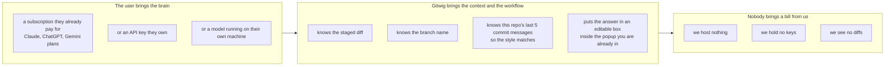

**What we do:** assemble good context, ask, and drop the answer somewhere editable.
**What we never do:** host inference, store secrets, auto-commit, or make you leave the TUI.

---

## 3. User journey

### 3.1 The happy path — what the user actually experiences

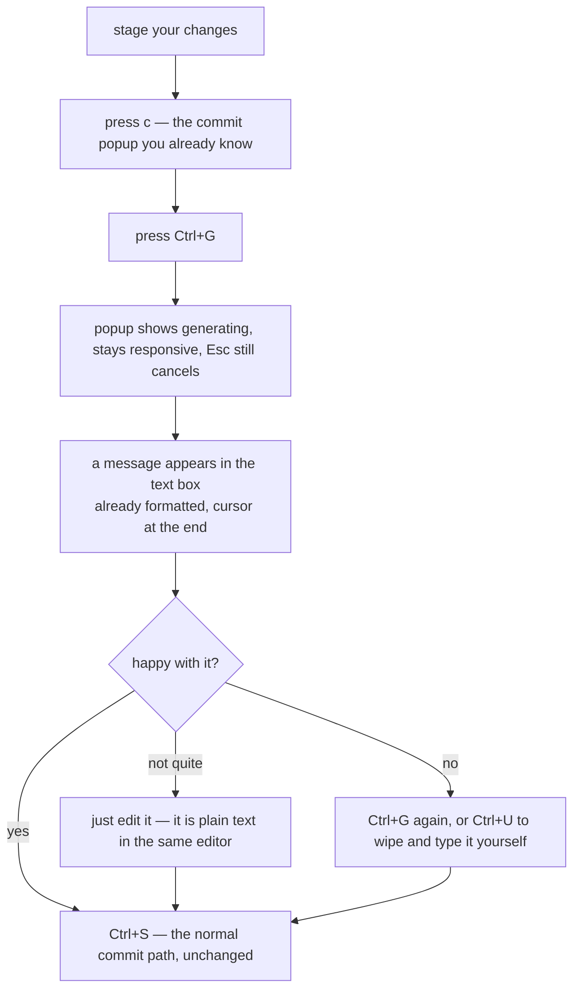

The whole point is that steps 1, 2 and the last step are **the flow that exists today**.
`Ctrl+G` is one optional keystroke inserted into a dialog the user is already sitting in.
Nothing is auto-committed, nothing new has to be learned, and the feature is invisible
until asked for.

### 3.2 First run — the only genuinely hard UX problem

A config field the user has never heard of is a dead feature. So the first `Ctrl+G`
looks around before it complains.

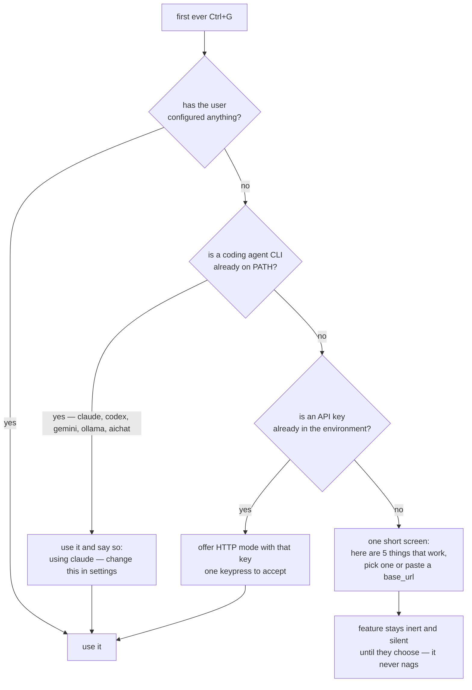

The rule: **a user who already pays for an AI subscription should get this working
without configuring anything.** That is the single biggest reason this route beats the
alternatives, and it only works if we probe instead of prompt.

### 3.3 Who gets what

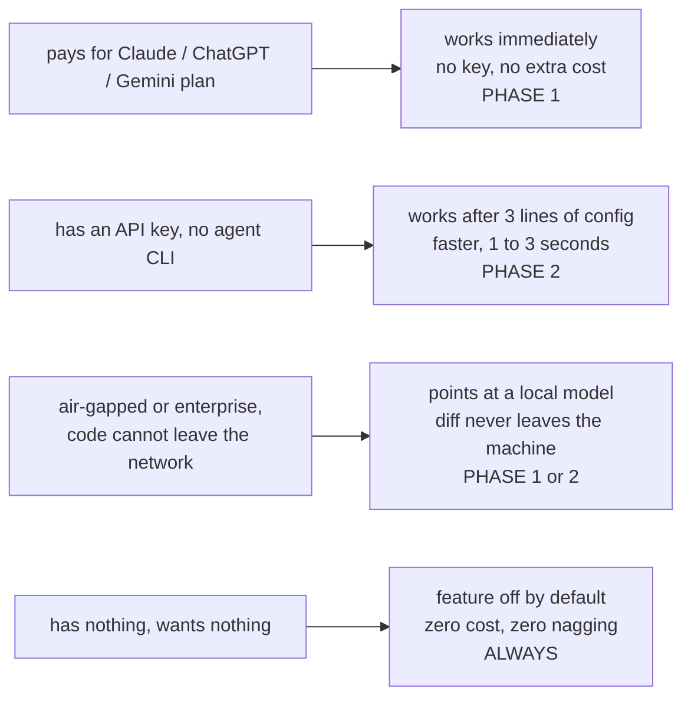

### 3.4 Where the diff goes — the trust question, per mode

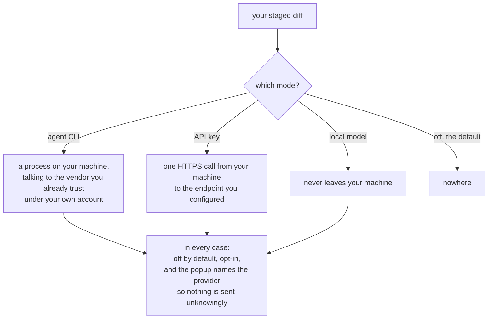

Gitwig is never in this picture as a middleman. That is a direct consequence of the
no-hosted-inference decision, and it is worth stating in user-facing docs as a feature.

---

## 4. Recommended path — implementation

**Ship Route A (delegate to the user's installed agent CLI) first, behind a
`MessageSource` indirection that Route B (one OpenAI-compatible HTTP adapter) plugs
into later.**

### 4.1 Control flow — matches the existing key-event pipeline in CODEMAP §4

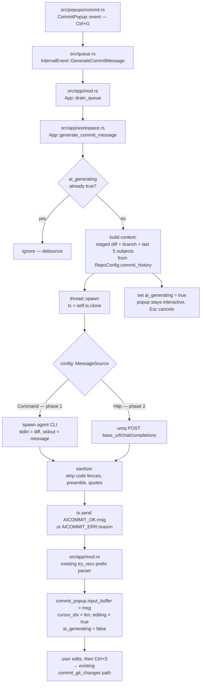

Almost everything here already exists: the queue, the drain, the `mpsc` prefix
convention, the popup editor, and `commit_git_changes`. The new code is one keybinding,
one `InternalEvent`, one method, and the source abstraction.

### 4.2 The indirection that makes phase 2 cheap

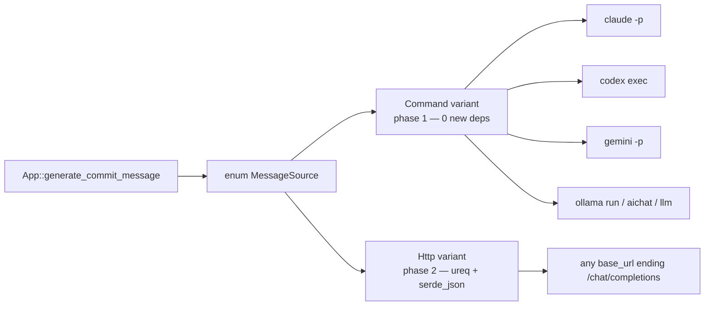

Defining both variants on day one but implementing only `Command` costs ~10 lines and
means phase 2 is an additive change, not a refactor.

---

## 5. Why this beats the alternatives

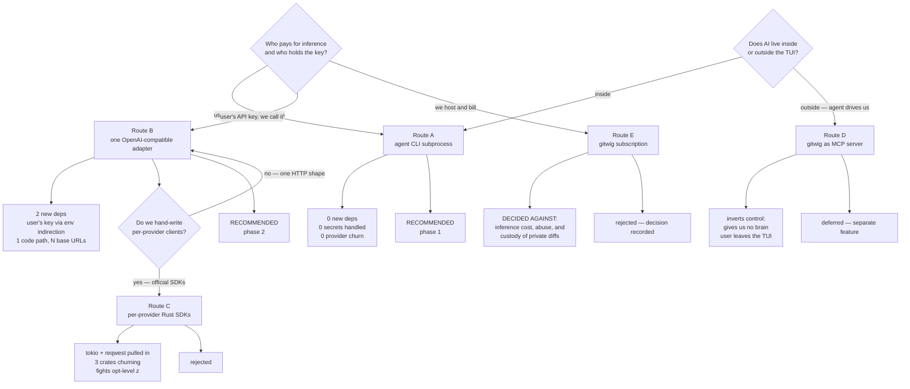

| Route | New deps | Provider maintenance when APIs drift | Latency | Works offline / local model | Who holds secrets | Verdict |
| :--- | :--- | :--- | :--- | :--- | :--- | :--- |
| **A. Agent CLI subprocess** | none | none — the CLI vendor absorbs it | 3–15 s | yes, via `ollama run` | nobody new | **Phase 1** |
| **B. OpenAI-compat HTTP** | `ureq`, `serde_json` | low — one request shape, config-only additions | 1–3 s | yes, `localhost:11434/v1` | user, via env-var indirection | **Phase 2** |
| C. Per-provider SDKs | `tokio`, `reqwest`, 3 SDK crates | high — independent version churn | 1–3 s | partial | user | Rejected |
| D. MCP server | MCP stack | n/a — solves the wrong direction | n/a | n/a | n/a | Deferred, unrelated |
| E. Hosted subscription | HTTP + auth + billing | we absorb *all* of it | 1–3 s | no | **us** | **Rejected** |

### Route A — how it actually runs

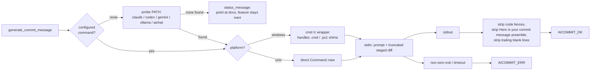

**Why it wins phase 1:** it validates every UX question — where the spinner goes, how
the amend case behaves, how much diff to send, what a failure looks like — at zero
dependency cost and zero security cost. The whole lazygit ecosystem
(`claude-lazygit`, `lazycommit`, `cfme`) converged on exactly this shape, which is
strong evidence it is what terminal users expect. Gitwig's audience already has one of
these CLIs installed.

**What it costs:** an install prerequisite, and latency, because a full agent CLI boots
an agent loop to write one sentence. The Windows shim is the real engineering risk.

### Route B — the answer to "how many providers do I support?"

The fear is real but mis-framed: **you do not count providers, you count base URLs.**

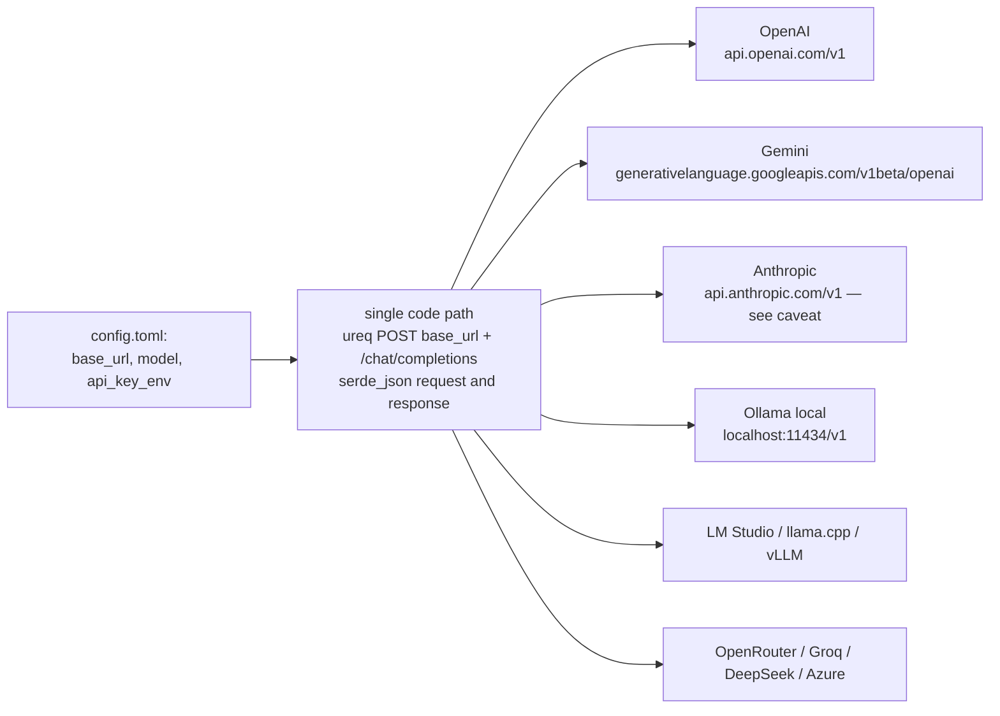

A new provider is **three lines of TOML the user writes**, not a crate we vendor. That
is what collapses the maintenance argument — and it is what `opencommit` does in
practice to cover OpenAI, Anthropic, Azure, Gemini, DeepSeek, Ollama and llama.cpp.

> **Caveat to record:** Anthropic documents its OpenAI-compatible layer as *"primarily
> intended to test and compare model capabilities"* rather than a long-term production
> path. Either accept that, or add a ~30-line native Messages request shape. Still no SDK.

### Route C — the shape being rejected

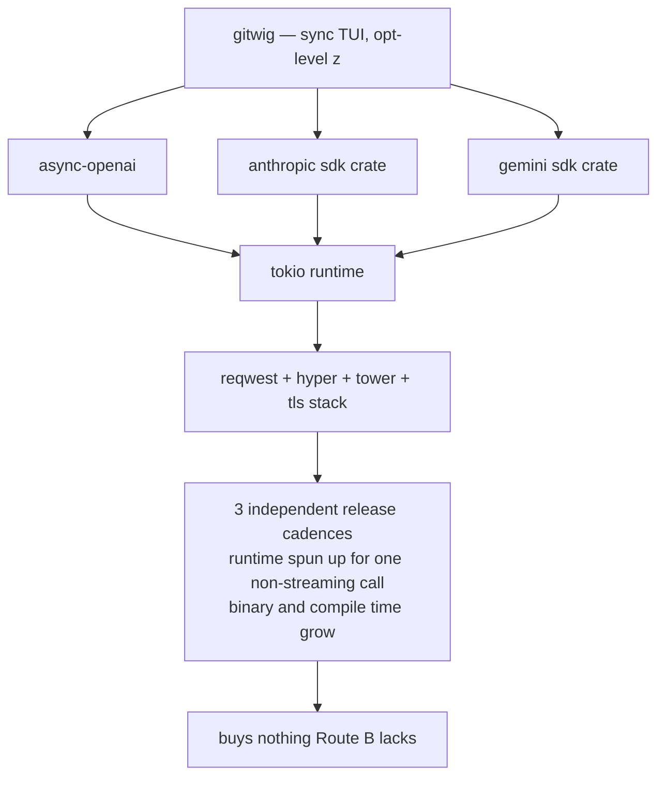

This is the concern that was correctly raised — package churn tracking provider
changes. Route B *is* the escape from it, so C never needs to exist.

### Route D — MCP inverts the control flow

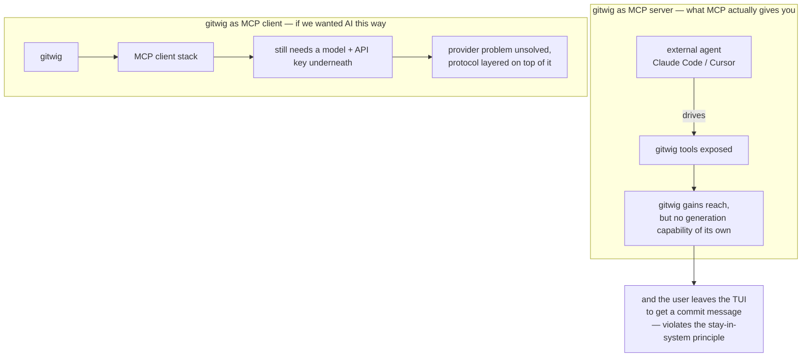

MCP does not give gitwig a brain, it hands gitwig's controls to something that already
has one. "Gitwig as MCP server" remains a legitimate, *separate* feature — letting an
agent query the multi-repo dashboard — and should be tracked independently of this one.

### Route E — hosted inference, rejected

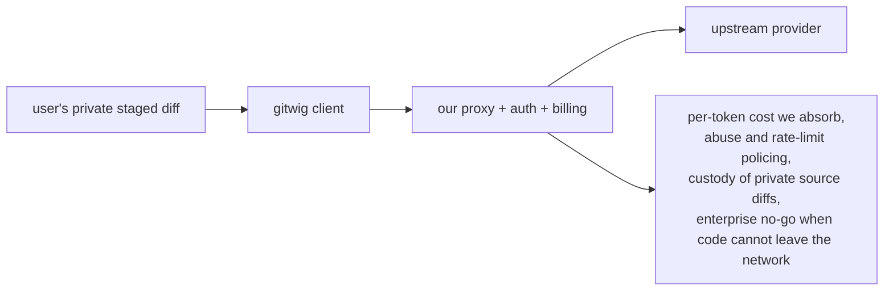

Best onboarding of any route — nothing to install, no key — but it turns an MIT-licensed
solo TUI into a service business with a data-protection obligation and an unbounded
inference bill. **Rejected.** Routes A and B reach the same users without any of it.

---

## 6. Invariants that apply to every route

These determine whether the feature feels good, independent of which backend wins.

| Invariant | Rationale | Touch point |
| :--- | :--- | :--- |
| **Never auto-commit.** Generate *into* `input_buffer`, leave `editing = true` | Preserves the existing confirm state; honours CODEMAP §5 safety rule | `src/app/workspace.rs` |
| Feed staged diff **plus** branch name **plus** last 5 subjects from `RepoConfig.commit_history` | Local style-matching is an edge no external tool has — we already persist this at `workspace.rs:937` | `src/config.rs`, `src/app/workspace.rs` |
| Truncate the diff, and say so in the status line | Token limits are our problem, silent truncation reads as a bad model | context builder |
| Do **not** reuse `app.fetching` | It swallows every key; a dedicated `ai_generating: bool` keeps `Esc` alive | `src/app/mod.rs` |
| Off by default, opt-in, provider name visible in the popup hint row | Nobody should ship a private diff to a third party unknowingly | `src/popups/commit.rs`, `src/config.rs` |
| Probe before prompting on first use | A config field nobody has heard of is a dead feature — see §3.2 | `src/app/workspace.rs` |
| Store `api_key_env = "OPENAI_API_KEY"`, never the key itself | `~/.gitwig/config.toml` sits next to repo paths and is not a secret store | `src/config.rs` |
| Log the call like existing `Network Action:` lines | Consistency with `debug_log` conventions, and auditability | `src/debug_log.rs` |
| Amend path must reuse the generated text sensibly | `start_commit_amend` pre-fills from `get_last_commit_message`; regeneration should replace, not append | `src/app/navigation.rs:2336` |

---

## 7. Phasing

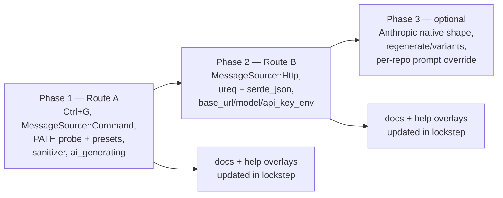

`⌃G` is unbound in `CommitPopup::event` today, so the roadmap's suggested key is free.

### Documentation lockstep checklist (per CODEMAP §5 and `.agent/INSTRUCTIONS.md`)

- `docs/keybindings.md` — the `CommitInput (Edit)` table already enumerates every binding
- `docs/panels.md` — Commit Message Dialog section, which already documents `Ctrl+H`
- `docs/detail_view.md` — Compose Mode description
- `src/popups/help.rs` and `src/popups/detail_help.rs` — in-app overlays
- `src/components/cmd_bar/mod.rs` — `commit_input_editing_entries` status-bar hints
- `docs/configuration.md` — new `[ai]` config block
- `.agent/ROADMAP.md:165` — tick the item, and split "gitwig as MCP server" into its own entry
- `src/app/tests.rs` — cover the sanitizer, the debounce guard, and `AICOMMIT_ERR` handling
- Fix the stale doc comment at `src/popups/commit.rs:1`, which already claims
  "conventional prefixes" and "GPG/SSH signing" support that does not exist

---

## 8. Sources

- [opencommit](https://github.com/di-sukharev/opencommit) — multi-provider via generic OpenAI-compatible calls
- [aicommits](https://github.com/nutlope/aicommits)
- [claude-lazygit](https://github.com/godlyfast/claude-lazygit), [lazycommit](https://github.com/m7medVision/lazycommit) — the custom-command precedent
- [Claude Code headless mode](https://code.claude.com/docs/en/headless)
- [Headless agent CLI comparison](https://www.developersdigest.tech/blog/headless-ai-coding-agents-ci-comparison-2026)
- [Ollama OpenAI compatibility](https://docs.ollama.com/api/openai-compatibility)
- [Gemini OpenAI compatibility](https://ai.google.dev/gemini-api/docs/openai)
- [Anthropic OpenAI SDK compatibility](https://platform.claude.com/docs/en/api/openai-sdk)
- [reqwest vs ureq vs hyper, 2026](https://rustify.rs/articles/rust-reqwest-vs-ureq-vs-hyper-2026)
