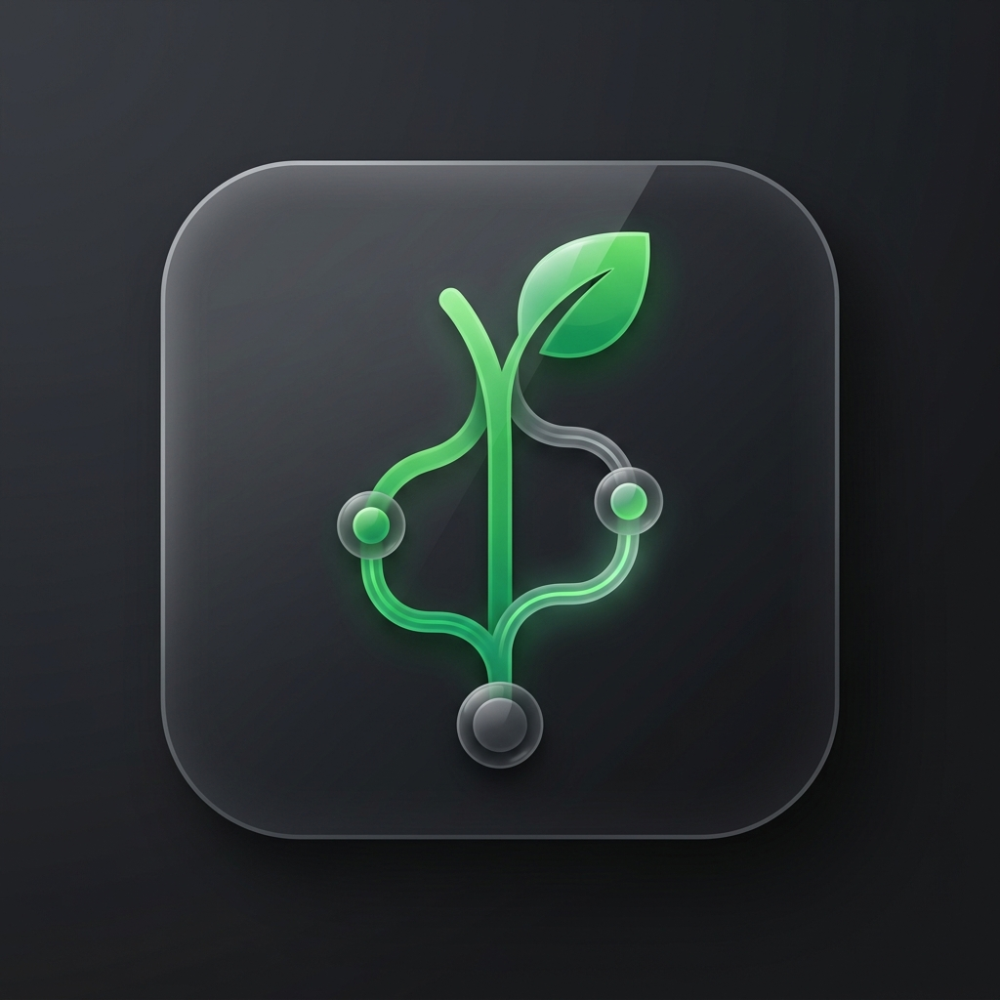

# 🌿 Gitwig — A Terminal Git TUI

<p align="center">
  
</p>


**Gitwig** (from **Git** + **Twig**, representing the branches of a repository) is a lightweight terminal-based Git UI, designed as a fast and minimal alternative to GUI tools like SourceTree. Built with Rust and `ratatui`, Gitwig presents your Git-related items in a clean, bordered layout directly in the terminal.

---

## 📸 Preview

> _(Coming soon — or add an asciinema/screenshot here!)_

---

## ✨ Features

- Fullscreen terminal UI using `ratatui` and `crossterm`
- Config-driven layout using `config.toml`
- Add / edit / delete items directly from the UI — changes persist back to the config file
- Per-item status indicators — see at a glance whether each item is a git repo, a plain directory, or missing
- Press `Enter` on any item to open a full-screen Detail view with branch, HEAD commit, remotes, and working-tree status (for git repos) or a clear "plain directory" / "missing" report otherwise
- Bordered items displayed inside a main border
- Mode-aware status bar that always shows the relevant shortcuts

---

## ⌨️ Keybindings

| Key                  | Mode            | Action                            |
| -------------------- | --------------- | --------------------------------- |
| `↑` / `k`            | Normal          | Move selection up                 |
| `↓` / `j`            | Normal          | Move selection down               |
| `a`                  | Normal          | Add a new item (via interactive fzf search) |
| `e`                  | Normal          | Edit the selected item            |
| `d`                  | Normal          | Delete the selected item (asks)   |
| `R`                  | Normal          | Refresh status of selected item   |
| `f`                  | Normal          | Enter repository search mode      |
| `p`                  | Normal          | Toggle pin status of selected item |
| `o`                  | Normal          | Cycle list sorting mode (Custom → Alphabetical → Recent → Changes) |
| `O`                  | Normal          | Toggle list sorting direction (ascending vs. reversed) |
| `g`                  | Normal          | Launch the preferred Git client for selected repository (configurable in settings, default is gitui) |
| `s`                  | Normal          | Open options/settings page        |
| `Enter`              | Normal / Commits list | Open Detail view for selected item / Inspect selected commit |
| `?`                  | Normal / Help   | Toggle the shortcut overlay       |
| `⎋` / `q`            | Normal          | Quit                              |
| `Esc`                | Normal          | Clear active repository search filter |
| `Enter`              | Editing         | Save the typed text and persist   |
| `Esc`                | Editing         | Cancel without saving             |
| `Enter`              | RepoSearchInput | Apply repository search and return to Normal mode |
| `Esc`                | RepoSearchInput | Clear repository search and return to Normal mode |
| `Enter`              | Settings (Edit) | Save settings edit                |
| `Esc`                | Settings (Edit) | Cancel settings edit              |
| `Esc` / `q`          | Settings        | Exit Settings and return to Home  |
| `↑` / `↓` / `k` / `j` | Settings        | Navigate setting fields           |
| `Enter` / `Space`    | Settings        | Toggle / Edit selected setting    |
| `Backspace`          | Editing         | Erase one character               |
| `y` / `Y`            | Confirm Dialog  | Confirm action (delete item/branch/tag, push branch/tag/all tags, abort/continue merge) |
| `n` / `N` / `Esc`    | Confirm Dialog  | Cancel action                     |
| `?` / `Esc` / `q`    | Help            | Close the help overlay            |
| `Esc` / `q`          | Detail          | Return to the list                |
| `Tab` / `Shift+Tab`  | Detail          | Cycle active detail view tabs (Workspace → Files → Graph → Branches → Tags → Remotes → Stashes → Overview) |
| `w` / `W`            | Detail          | Cycle panel focus forward (w) / backward (W) |
| `1` - `8`            | Detail          | Jump directly to tab: Workspace (1), Files (2), Graph (3), Branches (4), Tags (5), Remotes (6), Stashes (7), or Overview (8) |
| `↑` / `k`            | Detail          | Move selection or scroll list/diff/tree up |
| `↓` / `j`            | Detail          | Move selection or scroll list/diff/tree down |
| `PgUp` / `PgDn`      | Detail / Normal / Settings | Scroll list/diff/tree/settings by configured `page_size` |
| `Home` / `End`       | Detail / Normal / Settings | Jump to top / bottom of list/diff/tree/settings |
| `Enter`              | Detail          | Stage/Unstage file (Workspace tab), checkout branch (Branches tab), checkout tag (Tags tab), or Inspect commit |
| `f` / `F`            | Detail          | Fetch remote repository (Branches / Tags / Remotes tabs) |
| `p`                  | Detail          | Pull selected local branch from remote (Branches tab) or Push selected tag (Tags tab; asks confirmation) |
| `Shift+P`            | Detail          | Push selected local branch to remote (Branches tab) or Push all tags (Tags tab; asks confirmation) |
| `←` / `→`            | Detail          | Focus Local/Remote branch (Branches tab) or Local/Remote tag (Tags tab) |
| `←` / `→` or `<` / `>` or `,` / `.` | Detail | Collapse/Expand directory (Files tab) |
| `f`                  | Detail          | Fuzzy find files (Files tab)      |
| `Shift+H`            | Detail          | View selected file's commit/revision history (Files tab) |
| `c`                  | Detail          | Open commit prompt (Workspace tab or Inspect view), or Create branch from HEAD (Branches tab) |
| `a`                  | Detail          | Stage All (Workspace tab Unstaged focus) / Unstage All (Workspace tab Staged focus) or Apply stash (Stashes tab) |
| `x`                  | Detail          | Discard selected file changes (Workspace tab or Inspect view; asks confirmation) |
| `X`                  | Detail          | Discard all changes in repository (Workspace tab or Inspect view; asks confirmation) |
| `i`                  | Detail          | Interactive rebase from selected commit (Workspace tab commits list) |
| `d`                  | Detail          | Delete selected branch (Branches tab; asks confirmation), tag (Tags tab; asks confirmation), or stash (Stashes tab; asks confirmation) |
| `s`                  | Detail          | Open Stashing UI overlay (Workspace tab) or Prompt to save stash (Stashing UI / Stashes tab) |
| `u`                  | Detail          | Toggle "Stash untracked files" option (Stashing UI)               |
| `i`                  | Detail          | Toggle "Keep index" option (Stashing UI)                         |
| `Ctrl+U`             | Input (Stash)   | Toggle "Stash untracked files" option (Stash Create popup)       |
| `Ctrl+I`             | Input (Stash)   | Toggle "Keep index" option (Stash Create popup)                 |
| `m`                  | Detail          | Merge selected branch into current branch (Branches tab; asks confirmation) |
| `r`                  | Detail          | Rebase current branch onto selected branch (Branches tab; asks confirmation) |
| `o`                  | Detail          | Accept OURS version of conflict (Workspace tab Conflicts / ConflictDiff) |
| `t`                  | Detail          | Accept THEIRS version of conflict (Workspace tab Conflicts / ConflictDiff) |
| `r`                  | Detail          | Mark conflict as resolved (Workspace tab Conflicts / ConflictDiff) |
| `A`                  | Detail          | Abort the merge (Workspace tab Conflicts / ConflictDiff; asks confirmation) |
| `C`                  | Detail          | Continue the merge (Workspace tab Conflicts / ConflictDiff; asks confirmation) |
| `f`                  | Detail          | Open search column picker and go to logs (Workspace tab) |
| `R`                  | Detail          | Resync the active tab state       |
| `?`                  | Detail          | Toggle detail help overlay        |
| `Esc` / `q` / `?`    | DetailHelp      | Close detail help overlay         |
| `⌃C`                 | CommitInput (Edit) | Finish editing commit message (switches to confirm state) |
| `↵` (Enter)          | CommitInput (Edit) | Insert a newline                  |
| `Backspace`          | CommitInput (Edit) | Erase one character from commit message |
| `Esc`                | CommitInput     | Cancel commit and return to Detail view |
| `↵` (Enter)          | CommitInput (Confirm) | Submit / execute Git commit      |
| `e` / `E`            | CommitInput (Confirm) | Edit / resume typing commit message |
| `a` / `A` / `Space`  | CommitInput (Confirm) | Toggle amend last commit option   |
| `Left-Click` (Mouse) | Normal          | Select the clicked item           |
| `Double-Click` (Mouse)| Normal         | Open Detail view for clicked item |
| `Left-Click` (Mouse) | Detail          | Shift focus to the clicked panel or change active tab |
| `Left-Click + Drag` (Mouse) | Detail    | Drag panel boundary splitters to dynamically resize layout splits |
| `Scroll Wheel` (Mouse)| Normal / Detail | Scroll selected list, graph view, branches, tree items, or unified diffs |

Press `?` at any time in normal mode to see the full keybinding reference as a centered popup. The help overlay only handles the dismissal keys — your selection and scroll position are preserved underneath.

The selected card's border color mirrors the current operation mode:
- **Default (Muted)** — browsing the list (unselected).
- **Cyan** — browsing the list (selected).
- **Yellow** — typing into the input field during add/edit; the selected card's border turns yellow so you can see exactly which item will be replaced.
- **Red** — awaiting delete confirmation; the doomed card's border turns red.

The selected item is marked with a left-edge `▌` accent, a colored border, and bold text. In `ADDING` and `EDITING` modes the real terminal cursor sits at the end of your input so you can see exactly where the next character will land.

## 📂 Item status indicators

Each card shows a colored symbol on the right reflecting the item's filesystem state:

- `● git` — the item is a directory containing a `.git` entry (a git repository, worktree, or submodule).
- `○ dir` — the item is a directory, but not a git repository.
- `✕ missing` — the item is not a directory on this machine (doesn't exist, is a file, or isn't accessible).

For git repositories the indicator also shows compact counts for any non-zero values:

| Suffix | Meaning | Colour |
| ------ | ------- | ------ |
| `N+`   | N files staged for commit | Cyan |
| `N!`   | N files modified but not staged | Yellow |
| `N?`   | N untracked files | Muted |
| `N↑`   | N commits ahead of upstream (needs push) | Bold |
| `N↓`   | N commits behind upstream (needs pull/fetch) | Yellow |

When all counts are zero the indicator shows `● clean`. When the branch has no configured upstream, only the worktree counts appear (no `↑`/`↓`). Press `?` at any time to see the legend inside the app.

Items support `~` and `~/...` expansion, so `~/code/gitwig` resolves to your home directory. Statuses are recomputed only when you add, edit, or delete an item — they are not polled in the background. Press `r` to manually refresh the selected item's status if you've changed the filesystem outside the app (e.g. `git init` in a directory that was previously `○ dir`); the status bar briefly flashes `Refreshed` so you know the check ran.

## 🔍 Detail view

Press `Enter` on a selected item to open a full-screen Detail view. The detail view supports eight tabs for git repositories: **Details**, **Files**, **Graph**, **Branches**, **Tags**, **Remotes**, **Stashes**, and **Overview**.
- Press `1` to switch to the **Details** tab.
- Press `2` to switch to the **Files** tab.
- Press `3` to switch to the **Graph** tab.
- Press `4` to switch to the **Branches** tab.
- Press `5` to switch to the **Tags** tab.
- Press `6` to switch to the **Remotes** tab.
- Press `7` to switch to the **Stashes** tab.
- Press `8` to switch to the **Overview** tab.
- Alternatively, press `Tab` / `Shift+Tab` to cycle forward/backward through the tabs.
- You can also click on the tab headers directly with the mouse to switch tabs.
Press `Esc` or `q` to return to the repository list.

### Panel Layout & Navigation (Workspace Tab)

For a **git repository**, the **Workspace** tab is split into multiple rounded panels with a 40:60 width ratio on the bottom:
- **Commits (top 50%):** Lists the recent commits in the repository. If there are uncommitted changes, a special row named `Uncommitted changes` will be pinned to the very top.
- **Staging Area / Changed Files (bottom-left 40%):** Lists files that are modified, staged, or untracked. When `Uncommitted changes` is selected at the top, this panel is split vertically into `Staged` and `Unstaged` sections. When a real commit is selected, it is split horizontally, showing the list of files modified in that commit in the top half, and full commit details (hash, author, date, refs, and message) in the bottom half.
- **Staging Details (bottom-right 60%):** Displays the unified diff of the selected file.

### Files Tab

The **Files** tab displays all tracked files in the repository as an interactive directory tree on the left, and a preview panel on the right.
- Directory nodes are prefixed with `>` when collapsed and `▼` when expanded.
- File nodes are prefixed with `📄`.
- **Expand Folder:** Select a collapsed directory and press `>` or `.` or `Right-Arrow`.
- **Collapse Folder:** Select an expanded directory and press `<` or `,` or `Left-Arrow`.
- **Preview Panel:** Selecting a file displays its content (up to 100 KB) on the right; selecting a directory displays a list of files and folders directly inside it.
- **File History View:** Select any file in the tree and press `Shift+H` to open a history split-panel view, showing revisions on the left and the revision's diff on the right. Press `Tab` / `w` to cycle focus, and `Esc` / `q` to return.

### Graph Tab

The **Graph** tab renders the git log history graph / branch visualization graph.

### Branches Tab

The **Branches** tab is split vertically into left and right panels:
- **Local Branches (left):** Lists local branches in the repository, sorting the active branch to the top marked with ``.
- **Remote Branches (right):** Lists remote tracking branches.

You can focus either branch panel by pressing `w` / `W` or using the `←` / `→` arrow keys.

### Tags Tab

The **Tags** tab lists both local tags and remote tags.
- Select a local tag and press `↵` (Enter) to checkout that tag.
- Select any tag and press `d` / `D` to delete it (asks for confirmation).
- Press `p` to push the selected tag to the remote (asks for confirmation).
- Press `P` (Shift+P) to push all tags to the remote (asks for confirmation).

### Remotes Tab

The **Remotes** tab lists configured remotes for the repository.

### Stashes Tab

The **Stashes** tab lists all available stashes in the repository with a horizontally split layout:
- **Stashes (Top-Left):** Lists all stashes. Selecting a stash automatically highlights the first file in the files list. Press `d` / `D` to delete the selected stash, or `a` / `A` to apply it (both options ask for confirmation). When applying, you can toggle whether to delete the stash after applying (default is Yes).
- **Stashed Files (Bottom-Left):** Lists the files changed/saved in the selected stash.
- **Stash Diff (Right):** Shows the unified patch diff of the selected file.
- Navigate stashes or stashed files using `↑`/`k` and `↓`/`j`.

### Stashing UI

Pressing `s` / `S` inside the **Workspace** tab opens the dedicated **Stashing UI** overlay popup:
- **Left Panel:** Displays the list of all modified, staged, unstaged, untracked, and conflicted files that will be stashed. You can navigate through this list using `↑`/`↓`/`k`/`j`.
- **Right Panel:** Displays checkboxes for stashing options:
  - Toggle stashing untracked files with `u`.
  - Toggle keeping the index with `i`.
- **Actions:**
  - Press `s` to save the stash. This opens a text prompt to input an optional stash message/name (where stashing options can also be toggled with `Ctrl+U` and `Ctrl+I`).
  - Press `Esc` / `q` / `Q` to cancel and return to the Workspace view.

### Overview Tab

The **Overview** tab displays key repository details including resolved paths, branch upstream tracking info, configured remotes, and general status counts.

### Navigation & Interaction

You can navigate and interact with these panels in the following ways:
- **Cycle Focus:** In the Details, Files, Branches, Tags, and Stashes tabs, press `w` / `W` to cycle panel focus:
  - **Workspace tab:** `Commits` → `Staged` → `Unstaged` → `StagingDetails`.
  - **Files tab:** `Files` (left tree list) ↔ `FileContent` (right preview panel).
  - **Branches tab:** `Local Branches` ↔ `Remote Branches`.
  - **Tags tab:** `Local Tags` ↔ `Remote Tags`.
  - **Stashes tab:** `Stashes` → `Stashed Files` → `StagingDetails`.
  Focus defaults to the main panel of the tab when switching tabs (e.g., `Commits` on Workspace tab, `Files` on Files tab, `Local Branches` on Branches tab, `Local Tags` on Tags tab, `Stashes` on Stashes tab).
- **Mouse Click to Focus/Select:** Left-click inside any panel's boundaries (including branch/tag/stash list panels, stashed files list, files list, and the files tab content preview panel) to focus it immediately.
- **Resize Split Panels:** Left-click and drag the vertical or horizontal boundary splitter lines between panels to resize them dynamically. This is supported in:
  - **Workspace / Inspect:** Main vertical split (commits vs details), bottom horizontal split (left list vs right diff), and left vertical split (staged vs unstaged or commit details vs files list).
  - **Files:** Horizontal split (repository files tree vs file content preview).
  - **Branches:** Horizontal split (local branches vs remote branches).
  - **Stashes:** Horizontal split (stash lists vs diff) and left vertical split (stashes list vs stashed files).
  - **Overview:** Horizontal split (overview info vs committer stats).
- **Mouse Wheel Scroll:** Use the mouse wheel to scroll vertically through the active list, commit history, branch list, files list, stashed files list, staging details diff, or files tab preview panel.
- **Navigate Lists:** Use `↑`/`k` and `↓`/`j` to select a commit, file, branch, tag, stash, stashed file, or file tree item in the active list.
- **Scroll Diff:** When the `Staging Details` panel is focused, you can scroll the unified diff text vertically using `↑`/`k` and `↓`/`j` (line-by-line) or `PgUp`/`PgDn` (page-by-page).
- **Scroll File Content:** When the files tab `FileContent` preview panel is focused, you can scroll the preview text vertically using `↑`/`k` and `↓`/`j` (line-by-line) or `PgUp`/`PgDn` (page-by-page).
- **Stage/Unstage Files:** Select the `Uncommitted changes` row at the top, select a file in either the `Staged` or `Unstaged` list, and press `Enter` to stage or unstage that file instantly. Press `a` to Stage All (when focused on Unstaged) or Unstage All (when focused on Staged), which automatically shifts panel focus to the opposite list. Press `x` to discard changes in the selected file, or `X` to discard all changes in the repository (both ask for confirmation before performing).
- **Network Progress Bar:** Any long-running network operations (such as Fetch, Pull, or Push) will display a centering animated progress bar popup so the UI thread remains responsive and visual feedback is clear. If an operation hangs or takes too long, you can press `Esc` to force-dismiss the progress popup and resume TUI interaction immediately.
- **Multi-Remote Selection Picker:** For write operations (pushing branch/tags, deleting tags, fetching tags), if the repository has multiple configured remotes and no upstream tracking branch is set, a selection picker popup will appear allowing you to select which remote to target using ↑↓ and Enter.
- **Manage Branches:** While on the **Branches** tab:
  - Select any **local branch** (other than the currently active one) and press `Enter` to check it out (safe checkout strategy applies).
  - Press `f` / `F` to fetch updates from the remote in the background.
  - Select any **local branch** and press `p` to pull updates from its remote in the background (can only pull into the currently checked-out branch).
  - Select any **local branch** and press `Shift+P` to push it to the remote in the background (if no upstream is configured, it will attempt to push to the first configured remote and set it as the upstream tracking branch).
  - Select any **remote branch** and press `Enter` to check it out (this will switch to the branch, creating a local tracking branch if it doesn't already exist).
  - Press `c` / `C` to create a new branch from the currently checked out branch (or HEAD). A popup dialog will prompt for the new branch name.
  - Select any local or remote-tracking branch and press `d` / `D` to delete it. A confirmation dialog will prompt before performing the deletion. (The currently checked out branch cannot be deleted).
- **Commit Staged Changes / Amend Last Commit:** Press `c` from the Workspace tab or from the Inspect view to open a centered Commit popup window (active if there are staged changes OR a prior HEAD commit exists to amend). 
  - **Compose Mode:** Type your commit message. Press `Ctrl+C` to lock in the text and switch to confirmation state, press `Enter` to insert a newline, or `Esc` to cancel.
  - **Confirm Mode:** Press `Enter` to execute the commit, `e` to return to composing/editing the message, `a` / `A` / `Space` to toggle the "Amend last commit" option, or `Esc`/`q` to close the popup. Toggling amend to active when the buffer is empty automatically populates the text box with the message from the last commit.

For a **plain directory** the view confirms the resolved path and explains that no `.git` entry was found.

For a **missing** item the view confirms the resolved path and notes that the path does not exist or isn't accessible.

The detail snapshot is taken **once** when you press Enter — it is not refreshed while open (except for staging/unstaging actions which refresh dynamically). Close and re-open to re-read the repository state.

After every successful add / edit / delete, the status bar briefly shows `Saved` or `Deleted`. If the write fails, the status bar shows `Save failed: <reason>` instead — your in-memory list still reflects the change, but the file on disk does not.

### 🔀 Main Page Sorting

The main page repository list can be sorted dynamically using shortcuts:
- **Cycle Sort Order (`o`):** Cycles through the sorting modes: `Custom` (preserves your manual list order), `Alphabetical`, `Recent Visit` (tracks when you enter a repository's detail view), and `Latest Changes` (based on HEAD commit timestamps or folder modification times).
- **Toggle Sort Direction (`O`):** Toggles ascending vs. descending/reversed sort direction. The top border displays the active sort mode (e.g. `Sort: Alphabetical (Rev)`).

---

## 🔧 Configuration

Gitwig stores its config in `~/.gitwig/config.toml`. The directory is created automatically on first launch.

### First-run migration

If `~/.gitwig/config.toml` doesn't exist yet, Gitwig looks for an existing config to migrate from:

1. A path passed as the first CLI argument (`gitwig path/to/config.toml`).
2. `./config/config.toml` relative to the current working directory.
3. `./config/config.toml` relative to the executable.
4. `~/.config/gitwig/config.toml` (new XDG location), `~/.config/twig/config.toml` (legacy Twig XDG location), or `~/.twig/config.toml` (legacy Twig home location).
5. Nothing found — a default config is written to `~/.gitwig/config.toml`.

After the first run the migrated (or generated) file becomes the sole source of truth; the original is left untouched.

### Example: `config.toml`

```toml
items = ["Repo A", "Repo B", "Side Project", "Test Repo"]

# Event-loop poll interval in milliseconds (default: 100).
# Lower → more responsive input, higher → less CPU usage. Sane range: 16–500.
poll_interval_ms = 100

# Sorting preferences for the main page list
sort_by = "custom"
sort_reverse = false

# Enable compatibility mode to use simple ASCII symbols
compatibility_mode = false
```

### Config keys

| Key | Type | Default | Description |
| --- | ---- | ------- | ----------- |
| `items` | `[String]` | `[]` | Paths shown in the main list. Managed by the in-app `a` (fzf search) / `e` / `d` shortcuts. |
| `poll_interval_ms` | `Integer` | `100` | How long (ms) the event loop waits between input checks. Lower feels snappier; higher saves CPU. |
| `max_commits` | `Integer` | `0` | Maximum commits to load in workspace view. Set to `0` for unlimited. |
| `page_size` | `Integer` | `10` | Number of lines/items scrolled by Page Up / Page Down. |
| `sort_by` | `String` | `"custom"` | Main list sorting preference (`"custom"`, `"alphabetical"`, `"recent_visit"`, `"latest_changes"`). Managed by `o`. |
| `sort_reverse` | `Boolean` | `false` | Inverts the main list sorting direction (ascending vs. descending). Managed by `O`. |
| `theme` | `String` | `"default"` | Active theme configuration name. Managed in Settings `s`. |
| `compatibility_mode` | `Boolean` | `false` | Enable to use simple ASCII symbols instead of rich Unicode icons/emojis (prevents layout alignment issues in restricted terminals like RustRover's built-in terminal). |
| `fzf.max_depth` | `Integer` | `3` | Maximum directory depth to search for git repositories during discovery. |
| `fzf.start_dir` | `String` | `"$HOME"` | Starting directory for interactive repository discovery via FZF. |
| `fzf.excludes` | `[String]` | `[".git", "node_modules", "target"]` | Directory names excluded from FZF discovery. |

Gitwig writes back to whichever file it loaded from, so edits made in the UI persist across runs.

---

## 🎨 Font & Symbol Support

Gitwig uses rich Unicode symbols, icons, and Nerd Font glyphs (such as `●`, `○`, `✕`, `▶`, ``, etc.) to provide a premium, modern visual experience directly in the terminal.

To display these symbols correctly without layout breakage or replacement characters (e.g., question marks or empty blocks), your terminal emulator must use a font containing Nerd Font glyphs. 

### Recommended Font (Bundled)
We have bundled the clean and highly popular **JetBrains Mono Nerd Font** inside this repository:
- **Location:** `resources/fonts/JetBrainsMonoNerdFontMono-Regular.ttf`

#### 📥 How to Install the Font:
- **macOS:** Open the `resources/fonts/` directory in Finder, double-click `JetBrainsMonoNerdFontMono-Regular.ttf`, and click **Install Font**.
- **Windows:** Right-click `JetBrainsMonoNerdFontMono-Regular.ttf` and select **Install** (or **Install for all users**).
- **Linux:** Copy the font file to your local font directory:
  ```sh
  mkdir -p ~/.local/share/fonts
  cp resources/fonts/JetBrainsMonoNerdFontMono-Regular.ttf ~/.local/share/fonts/
  fc-cache -fv
  ```

#### ⚙️ How to Configure Your Terminal:
Open your terminal emulator settings (e.g. iTerm2, Alacritty, Kitty, Windows Terminal, macOS Terminal) and set the active font to **JetBrainsMono Nerd Font Mono** (or **JetBrainsMonoNF**).

### 🛠️ Compatibility Mode (No Font Install Required)
If you prefer not to install custom fonts, Gitwig includes a built-in fallback:
1. Open the settings popup in the app by pressing **`s`**.
2. Focus the `Compatibility Mode` option and toggle it to `true`.
3. Alternatively, add `compatibility_mode = true` in your `config.toml`.

When Compatibility Mode is active, Gitwig will automatically substitute all Nerd Font glyphs and complex emojis with standard ASCII and basic terminal symbols to ensure a clean, stable layout in any standard monospaced font.

---

## 🚀 Installation & Running

### Installation

You can install **Gitwig** directly from [crates.io](https://crates.io/crates/gitwig):

```sh
cargo install gitwig
```

### Building from Source

Alternatively, you can clone the repository and build it from source:

```sh
git clone https://github.com/tareqmy/gitwig.git
cd gitwig
cargo build --release
```

The compiled binary will be located at `target/release/gitwig`. You can copy it to a directory in your `$PATH` or run it directly.

### Running

```sh
# Run with default config resolution
gitwig

# Run with an explicit config path
gitwig path/to/config.toml
```
